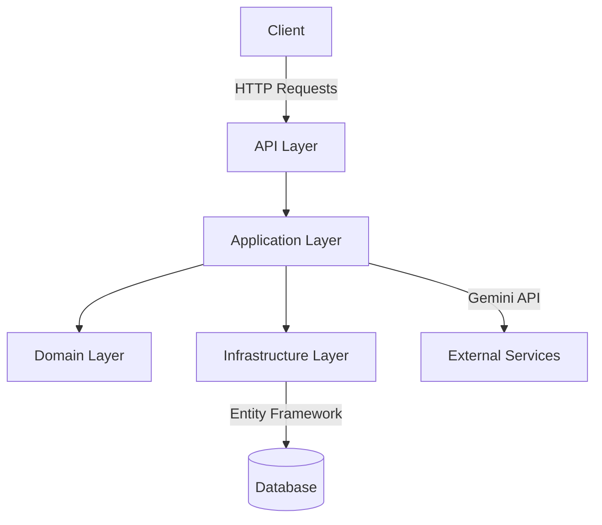
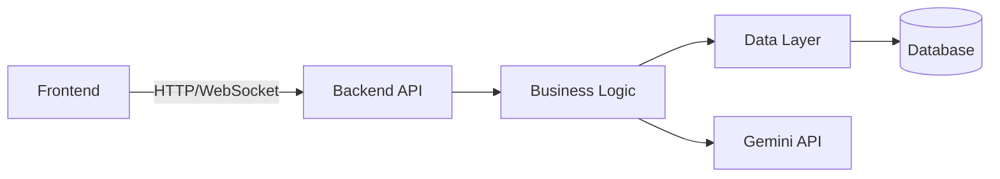

# Translation API System 🌐

[](https://dotnet.microsoft.com/download/dotnet/7.0)
[](https://dotnet.microsoft.com/apps/aspnet/web-apps/blazor)
[](https://ai.google.dev/docs/gemini_api)
[](https://www.microsoft.com/sql-server)
[](https://opensource.org/licenses/MIT)

A powerful multilingual translation system built with .NET and Blazor WebAssembly, leveraging Google's Gemini API for intelligent translations.

## ✨ Key Features

### 🔐 Authentication & Authorization
- Secure user registration and login system
- User profile management with role-based access control
- JWT (JSON Web Token) based API security
- Session management and token handling

### 🎯 Intelligent Translation
- Support for 30+ languages through Gemini API integration
- Automatic source language detection
- Smart handling of long texts with automatic chunking
- Preserves text formatting (line breaks, bullet points)
- Maintains proper names, brands, and technical terms
- Intelligent error handling with detailed notifications

### 👥 User Experience
- Clean and intuitive translation interface
- Quick language swap functionality
- One-click result copying
- Real-time translation updates

### ⚙️ System Administration
- AI model management (CRUD operations)
- User monitoring and management
- Detailed error logging and handling
- System performance optimization

## 🏗️ Technical Architecture

### 🔧 Backend (ASP.NET Core)
- RESTful API with OpenAPI/Swagger documentation
- Concurrent request handling and performance optimization
- Seamless Gemini API integration
- Entity Framework Core for data management



### 🎨 Frontend (Blazor WebAssembly)
- Responsive and interactive UI
- Efficient state management
- Visual error handling
- Cross-platform compatibility
- Real-time updates

## 🚀 Getting Started

### 📋 Prerequisites
- .NET 7.0 or later
- SQL Server
- Gemini API key

### ⚙️ Configuration
1. Clone repository
2. Update connection string in `appsettings.json`
3. Configure Gemini API key
4. Run database migrations:
   ```bash
   dotnet ef database update
   ```

### 🏃‍♂️ Running the Application
1. Start the API:
   ```bash
   cd TranslationApi.API
   dotnet run
   ```
2. Launch the Web UI:
   ```bash
   cd TranslationWeb
   dotnet run
   ```

## 📁 Project Structure

```
TranslationApi/
├── TranslationApi.API/          # API endpoints and controllers
├── TranslationApi.Application/  # Business logic and services
├── TranslationApi.Domain/       # Entities and business rules
├── TranslationApi.Infrastructure/ # Data access and integrations
└── TranslationWeb/              # Blazor WebAssembly UI
```

## 📊 System Architecture



## 📜 License

This project is licensed under the MIT License - see the LICENSE file for details.

---
<div align="center">
Made with ❤️ using .NET and Blazor
</div>